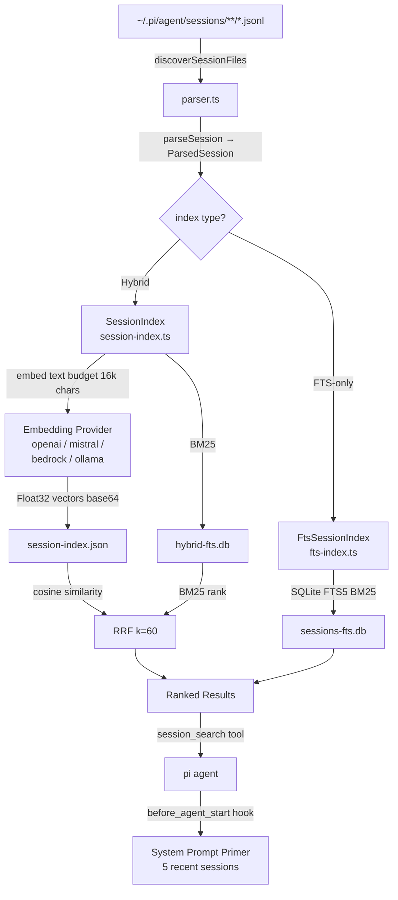

# pi-session-search Plugin — Developer Reference

## 1. Overview

`pi-session-search` (npm: `pi-session-search`, v1.0.0, MIT) is a **pi coding-agent extension** that indexes, summarises, and searches past pi coding sessions stored as JSONL files under `~/.pi/agent/sessions/`. It ships two modes:

| Mode | When active | Storage |
|------|-------------|---------|
| **FTS-only** (default, zero-config) | No `embedder` key in config | `sessions-fts.db` — SQLite FTS5 with Porter/unicode61 stemming |
| **Hybrid** (optional) | `embedder` configured | `session-index.json` (embedding vectors) + `hybrid-fts.db` side-car; results fused with Reciprocal Rank Fusion (RRF, k=60) |

A developer can add the extension to any pi project with no mandatory configuration. Optional embedding support unlocks semantic/hybrid search via OpenAI, Mistral, AWS Bedrock, Ollama, or any OpenAI-compatible endpoint.

**Node requirement:** 22.5+ (uses the experimental `node:sqlite` built-in; stable on Node 24+).  
**No build step required** — TypeScript is executed directly via `tsx`.

---

## 2. Architecture

```
┌─────────────────────────────────────────────────────────┐
│                    pi agent harness                      │
│                                                          │
│  Hooks: session_start, before_agent_start,               │
│         session_shutdown                                 │
│  Tools: session_search, session_list, session_read       │
│  Commands: /session-embeddings-setup, /session-sync,     │
│            /session-reindex                              │
└────────────────────────┬────────────────────────────────┘
                         │ ExtensionAPI (pi)
                         ▼
              ┌──────────────────────┐
              │     src/index.ts     │  ← entry point / wiring
              │  (lifecycle + tools) │
              └──────┬───────────────┘
                     │
          ┌──────────┴──────────┐
          ▼                     ▼
  ┌───────────────┐    ┌─────────────────────┐
  │ src/fts-      │    │ src/session-index.ts │
  │ index.ts      │    │  (hybrid: embeddings │
  │ FtsSessionIndex│   │   + FTS5 side-car)   │
  │ (BM25 only)   │    └──────────┬──────────┘
  └───────┬───────┘               │
          │             ┌─────────┴──────────┐
          │             │ embedding providers │
          │             │ (openai / mistral / │
          │             │  bedrock / ollama)  │
          │             └────────────────────┘
          │
          └──────────────┐
                         ▼
               ┌──────────────────┐
               │  src/parser.ts   │
               │ discoverSession- │
               │ Files()          │
               │ parseSession()   │
               └──────────────────┘
```

The entry point (`src/index.ts`) wires every pi API surface. At startup it reads config, selects the correct index implementation, and delegates all parsing to `parser.ts`. Both index classes share a common sync/search contract so `index.ts` is largely index-type-agnostic.

---

## 3. Pi Extension API Usage

### 3.1 Declaration (`package.json`)

```json
{
  "pi": {
    "extensions": ["./src/index.ts"],
    "skills":     ["./skills"]
  }
}
```

The `extensions` array points to one or more TypeScript files. Each file must export a **default function** with the signature:

```ts
export default function (pi: ExtensionAPI): void { … }
```

### 3.2 Lifecycle Hooks

```ts
pi.on("session_start",      async () => { … });
pi.on("before_agent_start", async (ctx) => { … });
pi.on("session_shutdown",   async () => { … });
```

| Hook | Purpose in this plugin |
|------|------------------------|
| `session_start` | Loads `~/.pi/session-search/config.json`, instantiates the correct index class, fires an async incremental sync with a **10-minute timeout**, and schedules a **5-minute** background sync interval |
| `before_agent_start` | Fetches the 5 most-recent sessions and injects them as a "Recent Sessions" block into the system prompt primer |
| `session_shutdown` | Cancels the background timer and closes the SQLite database handle |

### 3.3 Tools

Registered via `pi.registerTool(name, schema, handler)`:

| Tool | Description | Key parameters |
|------|-------------|----------------|
| `session_search` | Semantic/keyword search; returns ranked session summaries | `query`, `limit`, optional filters |
| `session_list` | Lists sessions with metadata; supports filter by project, date range, archived flag | `project`, `since`, `until`, `archived` |
| `session_read` | Full paginated conversation reader | `path`, `page`, `pageSize` — path is validated against the sessions root to prevent traversal |

### 3.4 Commands

Registered via `pi.registerCommand(name, handler)`:

| Command | Purpose |
|---------|---------|
| `/session-embeddings-setup` | Interactive wizard; prompts for provider/model/key, writes `~/.pi/session-search/config.json` |
| `/session-sync` | Triggers an immediate incremental sync (only changed/new files) |
| `/session-reindex` | Full rebuild — drops existing index and re-ingests all sessions |

---

## 4. Core Modules

### 4.1 Parser (`src/parser.ts`)

Two exported functions drive ingestion:

```
discoverSessionFiles(rootDir: string): string[]
parseSession(filePath: string): ParsedSession
```

`discoverSessionFiles` walks `~/.pi/agent/sessions/**/*.jsonl` and returns absolute paths. Each file encodes the **project slug** in the directory name using the format `--path-segments--` (e.g. `--home--user--myproject--`).

`parseSession` streams the JSONL file line by line and extracts a `ParsedSession` record with **50+ fields**, including:

- `messages` — full conversation (user + assistant turns)
- `tools` — tool calls and results
- `files` — file paths touched during the session
- `models`, `costs` — model usage and token cost summaries
- Metadata: start/end timestamps, session ID, project slug

**Budget cap during parse:** `MAX_ASSISTANT_TEXT = 50,000 chars`. In the stored hybrid index, assistant text is further truncated to **300-char snippets** to keep the index lean.

### 4.2 FTS Index (`src/fts-index.ts`)

```
class FtsSessionIndex
  open(dbPath)           → creates/opens sessions-fts.db
  sync(sessions)         → upsert changed sessions (change-detected by file size)
  search(query, limit)   → BM25-ranked results via SQLite FTS5
  close()
```

The SQLite FTS5 virtual table is configured with the **porter unicode61 tokenizer** for stemmed, Unicode-aware keyword matching. All indexed text (title, summary, messages, file paths) is concatenated into a single `content` column for simplicity.

**Change detection** uses file size rather than mtime — a deliberate choice to be robust against filesystem timestamp anomalies (e.g. network mounts, git checkouts).

Storage: single file `sessions-fts.db`.

### 4.3 Hybrid / Embedding Index (`src/session-index.ts`)

```
class SessionIndex
  open(indexPath, ftsPath)   → loads session-index.json + opens hybrid-fts.db
  sync(sessions)             → embed changed sessions, persist vectors + FTS upsert
  search(query, limit)       → cosine similarity (embedding) + BM25 (FTS) → RRF
  close()
```

#### Embedding text budget (16 k chars total)

| Source | Budget |
|--------|--------|
| User messages | 6,000 chars |
| Assistant messages | 3,000 chars |
| Compaction summaries | 4,000 chars |
| Branch/context info | 2,000 chars |
| Metadata | remainder |

#### Hybrid search (RRF)

```
candidate pool = max(limit × 5, 100)
cosine_rank + bm25_rank  →  RRF(k=60)  →  top-N results
```

Reciprocal Rank Fusion score: `1 / (k + rank)` summed across both lists.

#### Embedding providers (lazy-loaded)

| Provider | Config key |
|----------|-----------|
| OpenAI | `"openai"` |
| Mistral | `"mistral"` |
| AWS Bedrock | `"bedrock"` |
| Ollama | `"ollama"` |
| Any OpenAI-compatible endpoint | `"openai-compatible"` with custom `baseUrl` |

#### Index versioning

| Version | Notes |
|---------|-------|
| v1 | Incompatible; triggers full rebuild |
| v2 | Auto-migrated to v3: vectors re-encoded as base64 Float32, heavy fields stripped |
| **v3** (current) | Base64 Float32 encoding; ~17 MB savings per 2,000 sessions |

---

## 5. Data Flow Diagram



---

## 6. Configuration

Config file: `~/.pi/session-search/config.json`

### FTS-only (zero-config, no file needed)

No configuration required. The plugin detects the absence of an `embedder` key and falls back to FTS-only mode automatically.

### Hybrid mode example

```json
{
  "embedder": {
    "provider": "openai",
    "model": "text-embedding-3-small",
    "apiKey": "sk-..."
  }
}
```

For Ollama (local):

```json
{
  "embedder": {
    "provider": "ollama",
    "model": "nomic-embed-text"
  }
}
```

For an OpenAI-compatible endpoint:

```json
{
  "embedder": {
    "provider": "openai-compatible",
    "model": "your-model-name",
    "baseUrl": "https://your-endpoint/v1",
    "apiKey": "optional-key"
  }
}
```

The `/session-embeddings-setup` command generates this file interactively — no manual editing needed.

### Runtime parameters (compiled-in constants)

| Constant | Value | Purpose |
|----------|-------|---------|
| `INDEX_VERSION` | `3` | Triggers migration or rebuild on mismatch |
| Sync interval | 5 min | Background incremental sync period |
| Startup sync timeout | 10 min | Async sync abandoned after this |
| `MAX_ASSISTANT_TEXT` | 50,000 chars | Parse-time cap on assistant content |
| Stored assistant snippet | 300 chars | Truncation in persisted index entries |
| Embedding text budget | 16,000 chars | Total chars fed to embedder per session |
| RRF k | 60 | Rank fusion dampening factor |
| RRF candidate pool | max(limit×5, 100) | Pre-fusion candidate count |

---

## 7. Key Design Decisions & Constraints

### Node 22.5+ / `node:sqlite`
The plugin uses the **experimental built-in `node:sqlite`** module (no `better-sqlite3` or similar). This eliminates a native dependency but requires Node 22.5+ and is only fully stable on Node 24+. Plugin authors who need wider Node compatibility must substitute a different SQLite binding.

### File-size change detection (not mtime)
Sessions are re-indexed only when their file size changes. This is intentionally more conservative than mtime comparison and survives network-mounted filesystems and git operations that reset timestamps without altering content.

### No build step
TypeScript is run directly with `tsx`. Distributing source TypeScript avoids a compile/watch cycle and keeps the development loop fast, at the cost of a `tsx` runtime dependency.

### Project slug encoding
The project path is embedded in the JSONL directory name as `--segment1--segment2--` (path separators replaced by `--`). This avoids a separate metadata file and makes project filtering a pure string operation.

### Two-file hybrid index
Embedding vectors live in `session-index.json` and the FTS side-car lives in `hybrid-fts.db`. Separating them means the JSON blob can be loaded once into memory for cosine operations while SQLite handles keyword queries independently. The trade-off is two-file management instead of one.

### Index v2→v3 migration (base64 Float32)
Storing vectors as raw JSON arrays of floats is verbose. v3 re-encodes them as base64-encoded `Float32Array` buffers, saving roughly **17 MB per 2,000 sessions**. The migration runs automatically on first open when v2 is detected.

### Test framework
Tests use Node's built-in `node:test` runner (no Jest/Vitest). Run with `npm test`.

---

## 8. How to Build Your Own Similar Plugin

This step-by-step recipe shows how to replicate the architecture for any pi plugin that needs background indexing and search.

### Step 1 — Scaffold the package

```bash
mkdir my-pi-plugin && cd my-pi-plugin
npm init -y
npm install tsx typescript
```

Add the pi extension declaration to `package.json`:

```json
{
  "pi": {
    "extensions": ["./src/index.ts"],
    "skills":     ["./skills"]
  }
}
```

### Step 2 — Create the entry point (`src/index.ts`)

Export a default function that receives `ExtensionAPI`:

```ts
import type { ExtensionAPI } from "@pi/sdk"; // adjust to actual SDK package

export default function (pi: ExtensionAPI): void {
  let index: MyIndex | null = null;
  let timer: ReturnType<typeof setInterval> | null = null;

  pi.on("session_start", async () => {
    const config = await loadConfig();
    index = new MyIndex(config);
    await index.open();

    // Fire-and-forget initial sync with timeout
    Promise.race([
      index.sync(),
      new Promise<void>((_, reject) =>
        setTimeout(() => reject(new Error("sync timeout")), 600_000)),
    ]).catch(console.error);

    // Background periodic sync
    timer = setInterval(() => index?.sync().catch(console.error), 5 * 60_000);
  });

  pi.on("before_agent_start", async (ctx) => {
    const recent = await index?.listRecent(5) ?? [];
    if (recent.length) ctx.prependSystemPrompt(formatPrimer(recent));
  });

  pi.on("session_shutdown", async () => {
    if (timer) clearInterval(timer);
    await index?.close();
  });

  pi.registerTool("my_search", searchSchema, async (args) => {
    return index?.search(args.query, args.limit ?? 10);
  });

  pi.registerCommand("/my-reindex", async () => {
    await index?.rebuild();
    return "Reindex complete.";
  });
}
```

### Step 3 — Implement the parser

Write a `parser.ts` that converts your raw data files into a structured record:

```ts
export function discoverFiles(root: string): string[] {
  // glob or fs.readdirSync walk
}

export function parseFile(filePath: string): MyRecord {
  // stream/parse the file, extract fields
  // apply text budget caps to keep index small
}
```

Design decisions:
- **Cap text fields** at sensible limits (`MAX_TEXT = 50_000` during parse; truncate further in the stored index).
- **Detect changes by file size** (or a hash) rather than mtime.

### Step 4 — Implement the FTS index (`fts-index.ts`)

```ts
import { DatabaseSync } from "node:sqlite"; // Node 22.5+

export class FtsIndex {
  private db!: DatabaseSync;

  open(dbPath: string) {
    this.db = new DatabaseSync(dbPath);
    this.db.exec(`
      CREATE VIRTUAL TABLE IF NOT EXISTS docs
      USING fts5(id UNINDEXED, content, tokenize='porter unicode61');
    `);
  }

  upsert(record: MyRecord) {
    this.db.prepare(
      "INSERT OR REPLACE INTO docs(id, content) VALUES (?, ?)"
    ).run(record.id, record.searchableText);
  }

  search(query: string, limit = 10) {
    return this.db.prepare(
      "SELECT id FROM docs WHERE docs MATCH ? ORDER BY rank LIMIT ?"
    ).all(query, limit);
  }

  close() { this.db.close(); }
}
```

### Step 5 — Optionally add hybrid search (`session-index.ts` pattern)

1. **Choose an embedder** (OpenAI, Ollama, etc.) and keep it lazy-loaded.
2. **Store vectors** in a JSON file as base64-encoded `Float32Array` buffers (saves ~8× space vs. JSON float arrays).
3. **At search time** embed the query, compute cosine similarity against all stored vectors, and run the same query against FTS5.
4. **Fuse with RRF**:

```ts
function rrf(lists: string[][], k = 60): Map<string, number> {
  const scores = new Map<string, number>();
  for (const list of lists) {
    list.forEach((id, rank) => {
      scores.set(id, (scores.get(id) ?? 0) + 1 / (k + rank + 1));
    });
  }
  return new Map([...scores].sort((a, b) => b[1] - a[1]));
}
```

5. **Version your index** (`INDEX_VERSION` constant). On version mismatch, run an auto-migration or trigger a full rebuild.

### Step 6 — Add an interactive setup command

```ts
pi.registerCommand("/my-setup", async (ctx) => {
  const provider = await ctx.prompt("Choose provider (openai/ollama): ");
  const model    = await ctx.prompt("Model name: ");
  await fs.writeFile(CONFIG_PATH, JSON.stringify({ embedder: { provider, model } }));
  return "Config saved.";
});
```

### Step 7 — Write tests with `node:test`

```ts
import { test } from "node:test";
import assert from "node:assert/strict";

test("search returns results", async () => {
  const idx = new FtsIndex();
  idx.open(":memory:");
  idx.upsert({ id: "1", searchableText: "typescript node sqlite" });
  const results = idx.search("typescript");
  assert.equal(results.length, 1);
  idx.close();
});
```

Run with `npm test` (Node 22+, no extra runner needed).

### Step 8 — Protect file-read tools against path traversal

Any tool that reads files by user-supplied path must validate the path before opening it:

```ts
import path from "node:path";

function assertSafeReadPath(requestedPath: string, allowedRoot: string): void {
  const resolved = path.resolve(requestedPath);
  if (!resolved.startsWith(path.resolve(allowedRoot) + path.sep)) {
    throw new Error("Path traversal detected");
  }
}
```

### Summary checklist

- [ ] `package.json` `"pi"` extension declaration pointing to `src/index.ts`
- [ ] Default-export entry point wiring `session_start`, `before_agent_start`, `session_shutdown` hooks
- [ ] Parser with text-budget caps and size-based change detection
- [ ] FTS5 index with Porter/unicode61 tokenizer
- [ ] (Optional) Embedding vectors in base64 Float32, RRF fusion, versioned index migration
- [ ] Interactive setup command writing `~/.pi/<plugin>/config.json`
- [ ] Path traversal guard on all file-read tools
- [ ] `node:test` tests runnable with `npm test`
